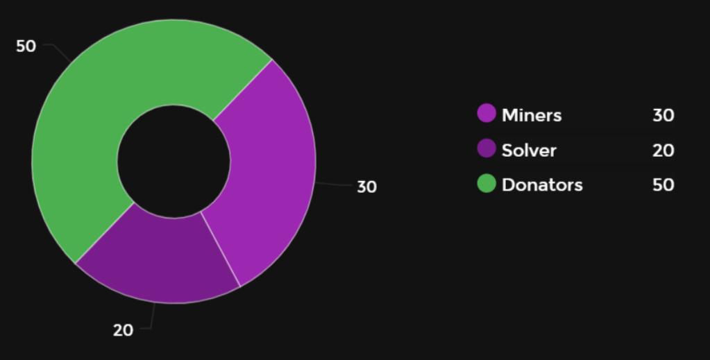
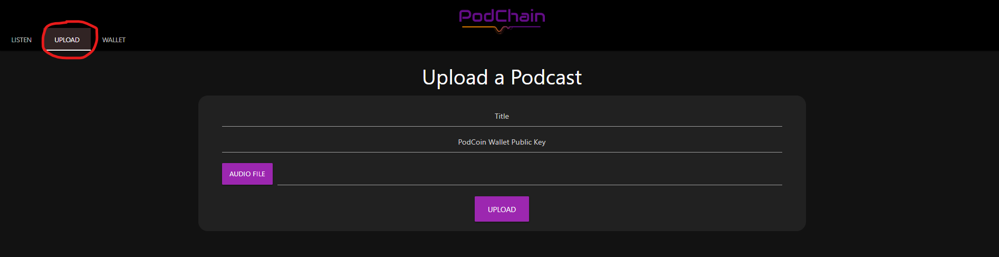
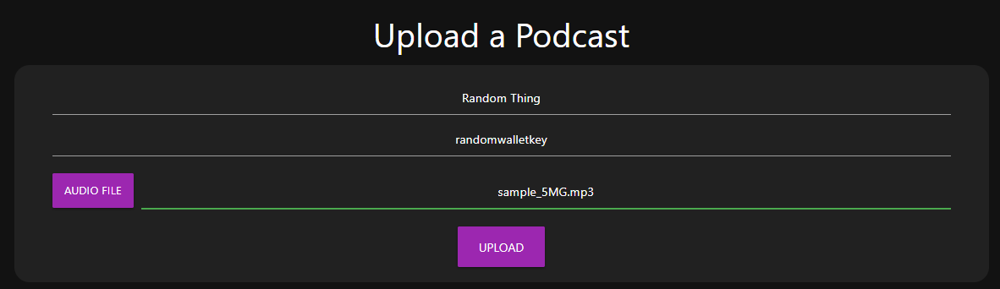
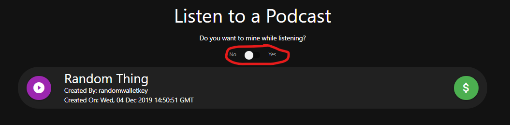
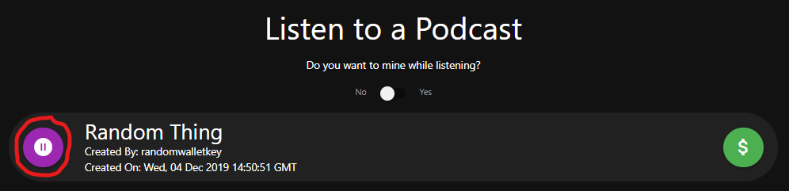
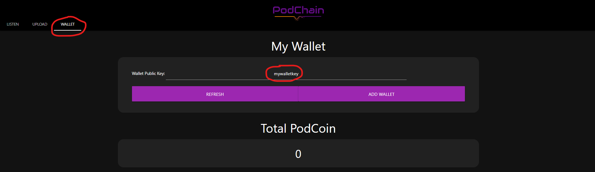
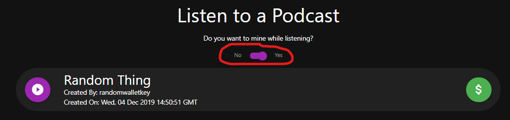
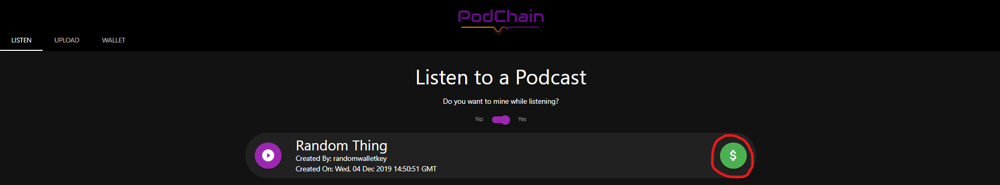
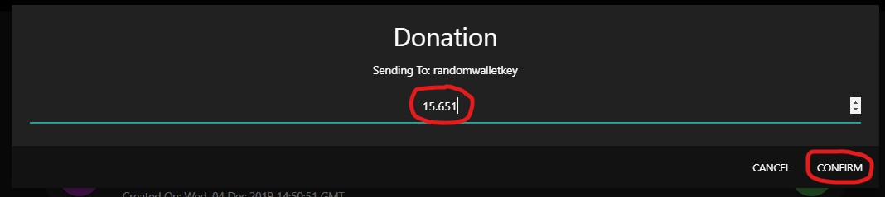

[pyversion-button]: https://img.shields.io/pypi/pyversions/Markdown.svg

1. [What is PodChain](#What-is-PodChain?)  
2. [Incentive System](#Incentive-System)
4. [How to Install](#How-to-Install)
5. [How to Run](#How-to-Run)
6. [How to Use](#How-to-Use)

## What is PodChain?

Hi! This is a podcasting application that provides incentive to listen due to the underlining cryptocurrency rewards. The application itself stores podcast data in a PostgreSQL DB. 

The users have the option to either listen anonymously, or provide the public key to their wallet so they can unlock the option to mine Podcoin while listening to podcasts and donate to podcast content creators.

## Incentive System



The users also have the option to contribute to podcast content creators. The content creators will receive 100% of the donations. The donators even get a 30% split of the block reward. This is split based on contributions/transactions on that block. The last 50% of the reward goes 20% to the solver of the block proof and 30% to the miners based on guesses provided.

## How to Install

### Dependencies

**NOTE: All dependencies and instructions assume Windows 10 OS**

1. Install PostgreSQL from [here](https://www.enterprisedb.com/thank-you-downloading-postgresql?anid=1257093).
2. Install Python 3.7.4 from [here](https://www.python.org/ftp/python/3.7.4/python-3.7.4-amd64.exe).
3. Make sure to add the correct folders to your path/
4. Clone this repository.
```powershell
git clone https://github.com/anirudhmungre/PodcastAsABlockchain.git
```

### Setup Database

Open the postgreSQL cli using powershell and run the following code from [generate.sql](database/generate.sql):
```postgresql
-- Create the appropriate Database and connect
CREATE DATABASE podcasting;
\c podcasting;

-- Create the extension required for UUID's
CREATE EXTENSION IF NOT EXISTS "uuid-ossp";

-- Remove the table if it already exists
DROP TABLE IF EXISTS Podcast;

-- Create the required table
CREATE TABLE Podcast
(
    id uuid NOT NULL DEFAULT uuid_generate_v1(),
    title text NOT NULL,
    media text NOT NULL,
    posterkey text NOT NULL,
    date timestamp without time zone NOT NULL DEFAULT now(),
    CONSTRAINT podcast_pkey PRIMARY KEY (id)
);
```
This will create a Database by the name of **podcasting** -> Connect to the database -> create a table **Podcast** with the appropriate fields.

## How to Run

### Database

1. Make sure postgres is running by opening pgadmin or starting the database from CLI
2. Put a **database.ini** file in the **server** directory with the following configuration
```ini
[postgresql]
host=localhost
database=podcasting
user=<postgres username. Default: postgres>
password=<postgres password. Default: postgres>
```

### Server

1. Enter the server folder.
```powershell
cd server
```
2. Activate the python virtual environment.
```powershell
podchain/Scritps/activate
```
3. Start the server instance on port **5000**.
```powershell
python main.py 5000
```

### Client

1. Enter the client folder.
```powershell
cd client
```
2. Start locally hosting a server for the client on port **8000**.
```powershell
python -m http.server 8000
```
3. Go to your browser *(This was tested in Chrome)* at http://localhost:8000 you should see a screen similar to the blank screen below.


## How to Use

Initially because the database is empty there will be no podcast options on the main page. This is how to perform different operations to use the application.

### Uploading

You can upload a podcast and will receive 100% of the donations to your podcast in PodCoin!

1. Click on the upload tab at the top of the page.

2. Enter the **title**, **podcoin wallet key**, and **upload a mp3 file** from /documentation/audio or your own.

3. **CLICK UPLOAD!**

### Listening

You can listen completely anonymously without entering a podcoin wallet key!

1. Make sure you're on the listen tab and you have mining set to off.

2. Click the play button on the podcast you want to listen to.

3. **ENJOY!**

### Managing Wallet

You can add a new wallet to the PodChain and view PodCoin funds!

1. Click on the wallet tab.  
2. Enter your PodCoin wallet key in the Key section.

3. Click **ADD WALLET** To add wallet to podchain.
3. Click **REFRESH** To check funds.

### Mining

You can use some of your computer resources to mine PodCoin while listening to PodCoin

1. Make sure you're on the listen tab and you have mining set to on.

2. Make sure you have a PodCoin wallet set in the wallet tab.
3. Start listening to any podcast and start mining!

### Donating

You can support your favorite content creators by donating to their podcasts!

1. Make sure you have a PodCoin wallet set in the wallet tab.
2. Click the green donation button on the podcast you would like to donate to.

3. Enter an amount below the amount in your wallet and click **CONFIRM**

